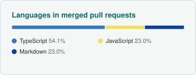
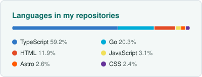

<!--
  Dark mode:
  --fgColor-accent: #7FD1C7;
  --fgColor-default: #FFFFFF;
  --bgColor-muted: #151B23;

  Light mode:
  --fgColor-accent: #0E6E66;
  --fgColor-accent-muted: #3A9188;
  --fgColor-default: #1F2D2B;
  --bgColor-muted: #F3F8F7;
-->

  <picture>
    <source media="(prefers-color-scheme: dark)" srcset="https://capsule-render.vercel.app/api?type=waving&height=90&color=0:112B2B%2C100:14B8A6&section=header&reversal=false" />
    <source media="(prefers-color-scheme: light), (prefers-color-scheme: no-preference)" srcset="https://capsule-render.vercel.app/api?type=waving&height=90&color=0:DDF1EC%2C100:7FD1C7&section=header&reversal=false" />
    
  </picture>

<!-- Generated daily by .github/workflows/update-cards.yml -->

  <picture>
    <source media="(prefers-color-scheme: dark)" srcset="./images/pr-languages-dark.svg" />
    <source media="(prefers-color-scheme: light), (prefers-color-scheme: no-preference)" srcset="./images/pr-languages-light.svg" />
    
  </picture>
  <picture>
    <source media="(prefers-color-scheme: dark)" srcset="./images/languages-dark.svg" />
    <source media="(prefers-color-scheme: light), (prefers-color-scheme: no-preference)" srcset="./images/languages-light.svg" />
    
  </picture>

<!--
  Activity cards are disabled while profile activity is private, because the
  card services then read 0 contributions.
  Remove this comment wrapper after making activity public.

  

    <picture>
      <source
        media="(prefers-color-scheme: dark)"
        srcset="https://github-readme-activity-graphkayan.vercel.app/graph?username=saryn17&theme=react-dark&bg_color=151B23&point=FFFFFF&hide_border=true&line=7FD1C7&color=7FD1C7&radius=10&height=400"
      />
      <source
        media="(prefers-color-scheme: light), (prefers-color-scheme: no-preference)"
        srcset="https://github-readme-activity-graphkayan.vercel.app/graph?username=saryn17&theme=minimal&bg_color=F3F8F7&point=1F2D2B&hide_border=true&line=3A9188&color=0E6E66&radius=10&height=400"
      />
      
    </picture>
  

  

    <picture>
      <source
        media="(prefers-color-scheme: dark)"
        srcset="https://streak-stats.demolab.com?user=saryn17&hide_border=true&border_radius=10&background=151B23&ring=7FD1C7&fire=7FD1C7&currStreakNum=FFFFFF&sideNums=FFFFFF&currStreakLabel=7FD1C7&sideLabels=FFFFFF&dates=FFFFFF"
      />
      <source
        media="(prefers-color-scheme: light), (prefers-color-scheme: no-preference)"
        srcset="https://streak-stats.demolab.com?user=saryn17&hide_border=true&border_radius=10&background=F3F8F7&ring=0E6E66&fire=0E6E66&currStreakNum=1F2D2B&sideNums=1F2D2B&currStreakLabel=0E6E66&sideLabels=1F2D2B&dates=1F2D2B"
      />
      
    </picture>
    <picture>
      <source
        media="(prefers-color-scheme: dark)"
        srcset="https://github-readme-stats-fast.vercel.app/api?username=saryn17&show_icons=true&hide_border=true&border_radius=10&icon_color=7FD1C7&text_color=FFFFFF&title_color=7FD1C7&bg_color=151B23"
      />
      <source
        media="(prefers-color-scheme: light), (prefers-color-scheme: no-preference)"
        srcset="https://github-readme-stats-fast.vercel.app/api?username=saryn17&show_icons=true&hide_border=true&border_radius=10&icon_color=3A9188&text_color=1F2D2B&title_color=0E6E66&bg_color=F3F8F7"
      />
      
    </picture>
  

-->

<h2 align="center"><samp><strong>CONTRIBUTIONS</strong></samp></h2>

  <a href="https://github.com/microsoft/azure-devops-mcp" target="_blank" rel="noopener noreferrer"><picture>
      <source
        media="(prefers-color-scheme: dark)"
        srcset="https://github-readme-stats-fast.vercel.app/api/pin/?username=microsoft&repo=azure-devops-mcp&icon_color=7FD1C7&text_color=FFFFFF&title_color=7FD1C7&bg_color=151B23&border_radius=10&hide_border=false&border_color=3D444D&description_lines_count=1"
      />
      <source
        media="(prefers-color-scheme: light), (prefers-color-scheme: no-preference)"
        srcset="https://github-readme-stats-fast.vercel.app/api/pin/?username=microsoft&repo=azure-devops-mcp&icon_color=3A9188&text_color=1F2D2B&title_color=0E6E66&bg_color=F3F8F7&border_radius=10&hide_border=false&border_color=D1D9E0&description_lines_count=1"
      />
      </picture></a>
  <a href="https://github.com/pingcap/docs" target="_blank" rel="noopener noreferrer"><picture>
      <source
        media="(prefers-color-scheme: dark)"
        srcset="https://github-readme-stats-fast.vercel.app/api/pin/?username=pingcap&repo=docs&icon_color=7FD1C7&text_color=FFFFFF&title_color=7FD1C7&bg_color=151B23&border_radius=10&hide_border=false&border_color=3D444D&description_lines_count=1"
      />
      <source
        media="(prefers-color-scheme: light), (prefers-color-scheme: no-preference)"
        srcset="https://github-readme-stats-fast.vercel.app/api/pin/?username=pingcap&repo=docs&icon_color=3A9188&text_color=1F2D2B&title_color=0E6E66&bg_color=F3F8F7&border_radius=10&hide_border=false&border_color=D1D9E0&description_lines_count=1"
      />
      </picture></a>
  <a href="https://github.com/eslint/eslint" target="_blank" rel="noopener noreferrer"><picture>
      <source
        media="(prefers-color-scheme: dark)"
        srcset="https://github-readme-stats-fast.vercel.app/api/pin/?username=eslint&repo=eslint&icon_color=7FD1C7&text_color=FFFFFF&title_color=7FD1C7&bg_color=151B23&border_radius=10&hide_border=false&border_color=3D444D&description_lines_count=1"
      />
      <source
        media="(prefers-color-scheme: light), (prefers-color-scheme: no-preference)"
        srcset="https://github-readme-stats-fast.vercel.app/api/pin/?username=eslint&repo=eslint&icon_color=3A9188&text_color=1F2D2B&title_color=0E6E66&bg_color=F3F8F7&border_radius=10&hide_border=false&border_color=D1D9E0&description_lines_count=1"
      />
      </picture></a>

  <picture>
    <source media="(prefers-color-scheme: dark)" srcset="https://capsule-render.vercel.app/api?type=waving&height=90&color=0:112B2B%2C100:14B8A6&section=footer&reversal=false" />
    <source media="(prefers-color-scheme: light), (prefers-color-scheme: no-preference)" srcset="https://capsule-render.vercel.app/api?type=waving&height=90&color=0:DDF1EC%2C100:7FD1C7&section=footer&reversal=false" />
    
  </picture>

